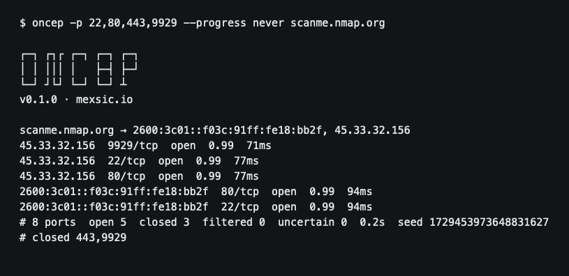
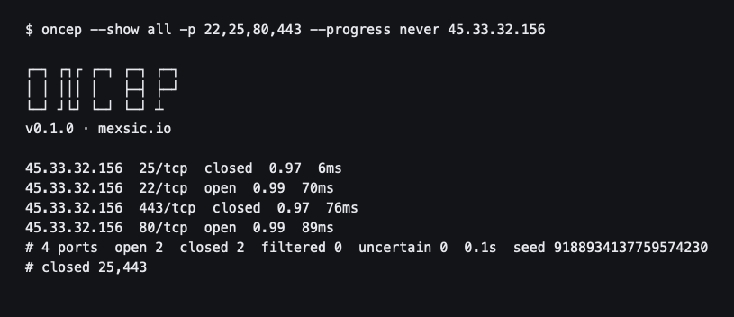
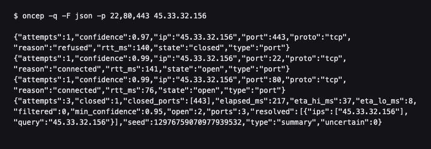

# oncep

TCP port scanner written in Rust. It opens a normal TCP connection, so it does not need root and it does not link to libpcap. Every port comes back with a confidence, and the scan tells you how long is left.



[Features](#features) · [Installation](#installation) · [Usage](#usage) · [Running oncep](#running-oncep) · [Output](#output) · [Confidence](#confidence)

oncep is made by [Mexsic](https://mexsic.io).

## Features

- Connect scan on macOS and Linux. No raw sockets.
- IPv4 and IPv6. A hostname is resolved once, and each address is scanned.
- A confidence for `open`, `closed`, `filtered`, and `uncertain`.
- An ETA on stderr while the scan is running.
- Three attempts per port by default. A reply finishes the port. Silence can stop early once the host has answered and the confidence is high enough.
- Text, TSV, and JSON lines.
- A quiet mode for pipes and files.
- CIDR targets, with a cap so an enormous prefix is rejected.

## Installation

Rust 1.75 or newer. Install it from [rustup.rs](https://rustup.rs) if you do not have it.

```bash
git clone https://github.com/kian-cx/oncep.git
cd oncep
cargo build --release
./target/release/oncep --help
```

The binary is `target/release/oncep`. On macOS it links against the system, and it matches the architecture you compile on. On Linux it links against that machine's glibc. The image below is the portable Linux build: the binary is compiled inside Debian bookworm and runs on that base.

### Docker

```bash
docker build -t oncep .
docker run --rm oncep --help
docker run --rm oncep -q -p 22,80,443 example.com
```

To build both Linux architectures:

```bash
docker buildx build --platform linux/amd64,linux/arm64 -t oncep .
```

## Usage

```
oncep --help
```

```
┌─┐ ┌┐┌ ┌─┐ ┌─┐ ┌─┐
│ │ │││ │   ├─┤ ├─┘
└─┘ ┘└┘ └─┘ └─┘ ┴
v0.1.0 · mexsic.io

TCP port scanner with per-port confidence and an ETA

Usage: oncep [OPTIONS] [TARGETS]...

Arguments:
  [TARGETS]...  IP, hostname, or CIDR. A large CIDR has to be written out

Options:
  -p, --ports <PORTS>
          Ports: 22 | 80,443 | 1-1024 | - for 1-65535 [default: 1-1024]
      --attempts <ATTEMPTS>
          Maximum attempts per port. A silence stops at --min-confidence once the host has answered [default: 3]
      --insist
          Spend the whole budget even after a reply or enough confidence
      --min-confidence <MIN_CONFIDENCE>
          Below this, the published state is uncertain [default: 0.95]
      --timeout <TIMEOUT>
          Timeout ceiling, in milliseconds. The floor is 100 [default: 2000]
  -c, --concurrency <CONCURRENCY>
          Simultaneous attempts. The default comes from the open-file limit
      --rate <RATE>
          Attempts per second [default: 2000]
      --seed <SEED>
          Shuffle seed. It is printed in the JSON summary
      --ordered
          Do not shuffle the ports
  -f, --targets <TARGETS_FILE>
          File with one target per line
      --exclude <EXCLUDE>
          Ports to skip. Same syntax as --ports
      --force
          Keep going even if the 24-port sample gets no reply
  -q, --quiet
          No banner and no progress. The text summary goes to the result output
      --progress <PROGRESS>
          auto, always, or never [default: auto]
  -F, --format <FORMAT>
          text, txt, or json [default: text]
      --show <SHOW>
          For text: open or all. txt and json always write every port [default: open]
  -o, --output <OUTPUT>
          Result file. Progress stays on stderr
```

## Running oncep

Scan a host. The default range is `1-1024`. This run asks for four ports on the host Nmap publishes for tool tests.

```bash
oncep -p 22,80,443,9929 --progress never scanme.nmap.org
```

The name is resolved once. Both the IPv4 and the IPv6 address are scanned, and open ports are printed as they answer. A text line is `ip`, `port/tcp`, state, confidence, and the round-trip time.

```
scanme.nmap.org → 2600:3c01::f03c:91ff:fe18:bb2f, 45.33.32.156
45.33.32.156  22/tcp  open  0.99  77ms
2600:3c01::f03c:91ff:fe18:bb2f  22/tcp  open  0.99  94ms
# 8 ports  open 5  closed 3  filtered 0  uncertain 0  0.2s  seed 1729453973648831627
# closed 443,9929
```

`# closed` lists port numbers that were closed on at least one address. In this run `9929` was open on IPv4 and closed on IPv6, so it is both an open line and in that list.

### Every state

`--show all` prints closed ports too. One completed connection is `open` at `0.99`. One refusal is `closed` at `0.97`.



```bash
oncep --show all -p 22,25,80,443 --progress never 45.33.32.156
```

### Ports

```bash
oncep -p 22 example.com
oncep -p 80,443 example.com
oncep -p 1-1024 example.com
oncep -p - example.com          # 1-65535
oncep -p 1-1024 --exclude 80,443 example.com
```

### Progress

On a terminal, stderr redraws one line about ten times a second:

```
60%  24/40  open 1  237 p/s  eta ~0:00:00
```

The tilde stays until 32 ports have finished, which is when the estimate has enough of the scan behind it. `--progress never` hides that line and keeps the banner. `-q` hides both, and the text summary moves to the result output.

### JSON

`-F json` writes one JSON object per line: every port, then a summary. `-q` keeps the banner and the progress line out of the way.



```bash
oncep -q -F json -p 22,80,443 45.33.32.156
```

```json
{"attempts":1,"confidence":0.97,"ip":"45.33.32.156","port":443,"proto":"tcp","reason":"refused","rtt_ms":140,"state":"closed","type":"port"}
{"attempts":1,"confidence":0.99,"ip":"45.33.32.156","port":22,"proto":"tcp","reason":"connected","rtt_ms":141,"state":"open","type":"port"}
{"attempts":1,"confidence":0.99,"ip":"45.33.32.156","port":80,"proto":"tcp","reason":"connected","rtt_ms":76,"state":"open","type":"port"}
{"attempts":3,"closed":1,"closed_ports":[443],"elapsed_ms":217,"eta_hi_ms":37,"eta_lo_ms":8,"filtered":0,"min_confidence":0.95,"open":2,"ports":3,"resolved":[{"ips":["45.33.32.156"],"query":"45.33.32.156"}],"seed":12976759070977939532,"type":"summary","uncertain":0}
```

Each object is one line. The summary is the last line.

`-o result.json` writes the result to a file. Progress stays on stderr.

### TSV

`-F txt` writes every port as TSV and does not write a summary. The columns are ip, port, `tcp`, state, confidence, attempts, round-trip time, and reason.

```bash
oncep -q -F txt -p 22,80 10.0.0.1
```

### More than one target

```bash
oncep -f targets.txt
oncep 10.0.0.0/24 -p 22,80
oncep --rate 500 -c 64 example.com
oncep --insist -p 1-1024 example.com
oncep --seed 1 --ordered -p 22,80,443 example.com
```

`-f` reads one target per line. Empty lines and lines that start with `#` are skipped. A literal single IP is not repeated on stderr. If the resolver does not answer, oncep exits after 5 seconds.

An IPv4 prefix has to be `/16` or smaller in span. An IPv6 prefix has to be `/112` or smaller in span. The limit is 65536 addresses.

## Output

| | text | txt | json |
| --- | --- | --- | --- |
| Default | yes | | |
| Open ports only, unless `--show all` | yes | | |
| Every port | with `--show all` | yes | yes |
| Summary | yes | | yes, last line |
| Where it goes | stdout, summary on stderr | stdout | stdout |

`-q` or `-o` changes the text summary: with `-q` and no file, it joins the other results on stdout. With `-o`, the whole result is the file.

The summary records the seed. Pass that seed back with `--seed` to repeat the same port order. `--ordered` turns the shuffle off.

JSON also records `resolved` (the name and its addresses), `closed_ports` when there are not too many to list, `eta_lo_ms`, and `eta_hi_ms`. Those two are frozen once 32 ports have finished.

## Confidence

Each port has a budget of 3 attempts.

- A completed connection finishes the port. One connection publishes `open` at `0.99`.
- A refusal finishes the port. One refusal publishes `closed` at `0.97`.
- Silence is `filtered` only when the confidence reaches `--min-confidence` (0.95). Until the host has answered enough times for that estimate to mean something, a silent port spends the whole budget.
- If the budget runs out below the threshold, the state is `uncertain`.
- `--insist` spends all 3 attempts even after a reply or a high confidence.

Before the rest of a host is scanned, oncep probes a sample of up to 24 ports: common ports that are in the list, both ends of the range, and a spread of what remains. If that sample gets no reply, the rest of the host is skipped and reported as `no-response`. `--force` scans the rest anyway.

The ETA uses the ports already finished, the ports left, and how long a reply or a silence has been taking. It is divided by the attempts that can actually run at once, including the per-host cap.

## Notes

Scan hosts you are allowed to scan.

oncep only completes TCP connections. It does not send SYN probes, UDP, or banner grabs, and it does not spoof its source address.
